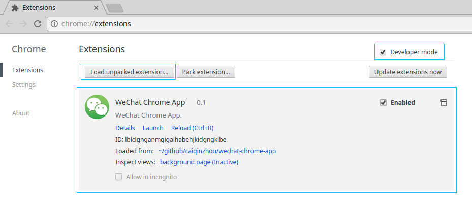

# WeChat Chrome App

It's a wechat chrome app wrapper(https://wx.qq.com).

# Install in Chrome

- Clone repo: `git clone https://github.com/caiqinzhou/wechat-chrome-app.git`
- Tools > Extensions. _Make sure the Developer mode checkbox has been selected._
- Click the Load unpacked extension button, navigate to your app's folder and click OK.
- You can find the app in chrome app panel, and you create a shortcut for this app too.

# Chrome App安装(Chinese)

- Clone项目: `git clone https://github.com/caiqinzhou/wechat-chrome-app.git`。
- 进入扩展程序界面,工具->扩展程序，选中开发者模式。
- 点击"load unpacked extension", 找到wechat-chrome-app目录，点击确认。
- 你可以在Chrome的应用面板中找到WeChat App，也可以给此应用创建一个快捷方式。

